# data-analyst-jagmeet
This repository presents my AWS portfolio, including four important modules related to theory and practice. Modules 1-3 are concerned with fundamental principles of AWS, such as cloud service and deployment types, world infrastructure, billing, and account structure, with corresponding case studies and graphics. Module 4-7 encompasses hands-on labs in IAM, VPC, Lambda, and EBS with the focus on the AWS Shared Responsibility Model and cost-effective cloud architecture, as well as screenshots and labs confirmation. The GitHub repository was lastly created and presented here as a live professional display of completed AWS work.
README.md
screenshots/
  user1_permissions.png
  ec2_error.png

  ### 🧾 IAMDashboard
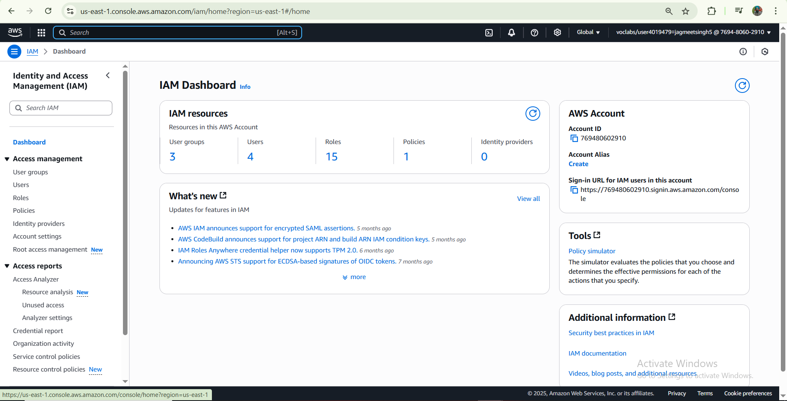

### 🧾 Testing-3InstanceEntersStopingstate
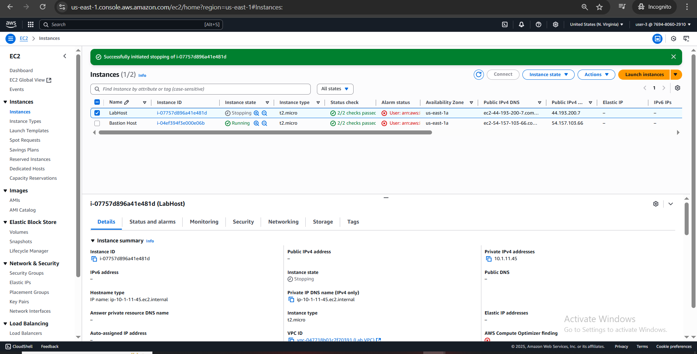

### 🧾 TestingBucket-S3
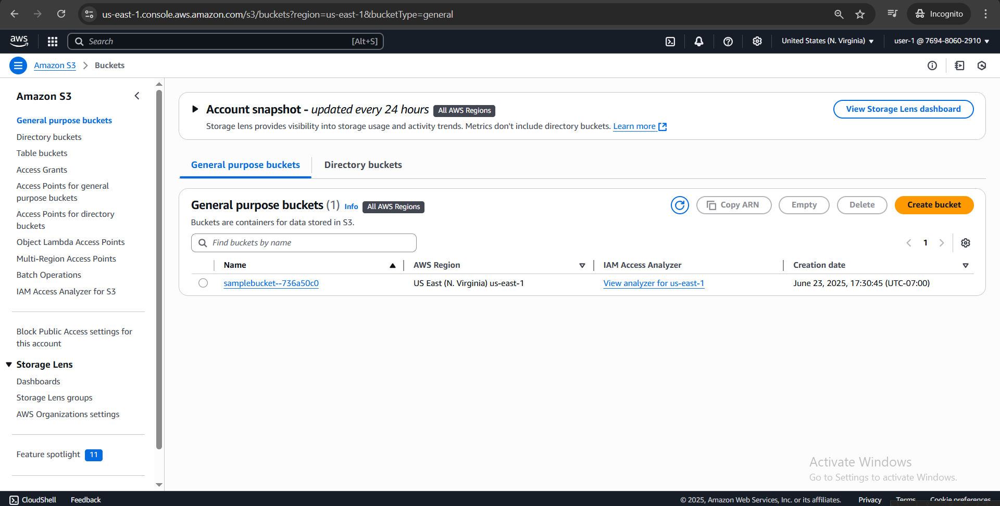
### 🧾 User-S3Support
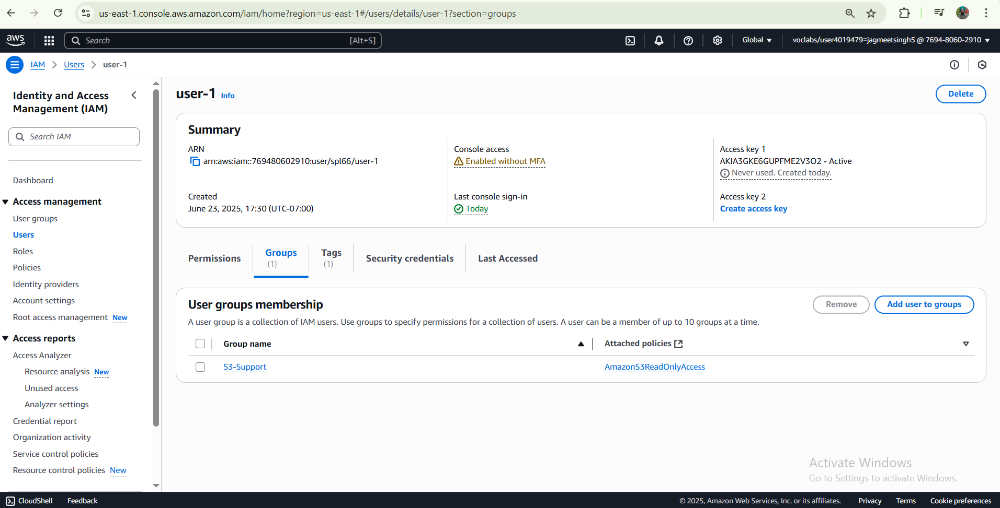
### 🧾 VPCInternetGatewayConnection
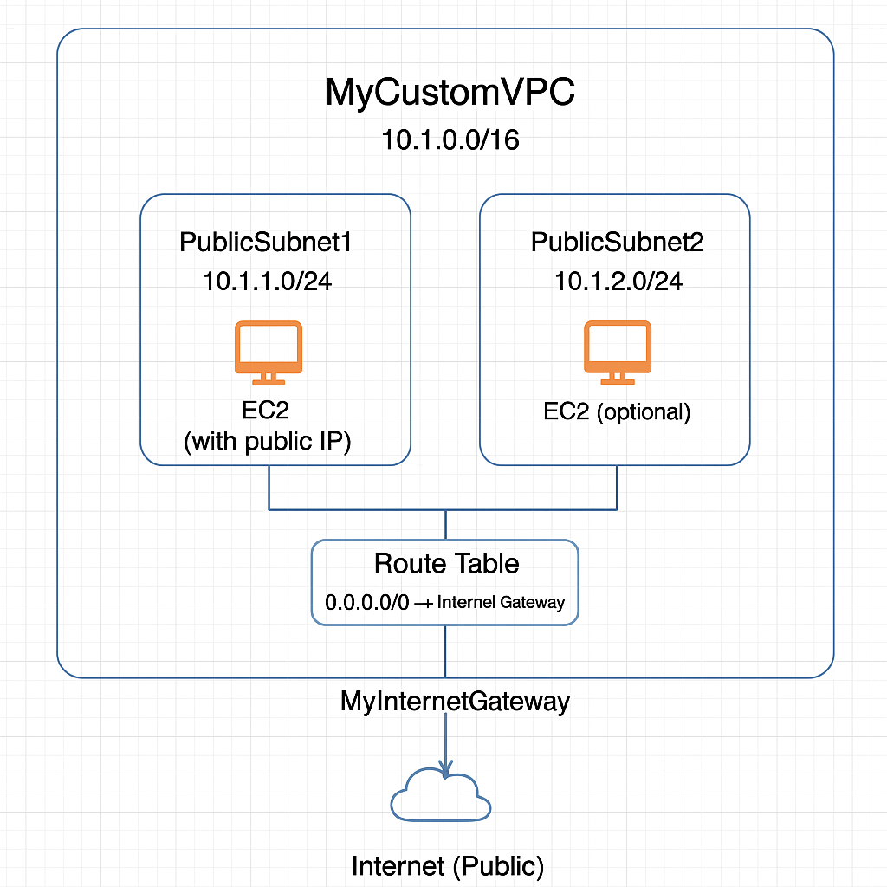
### 🧾 VPCInternetGateway
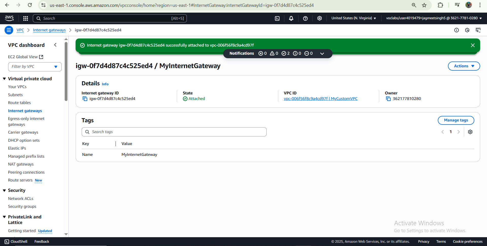
### 🧾 VPCPublicPrivateSubnets
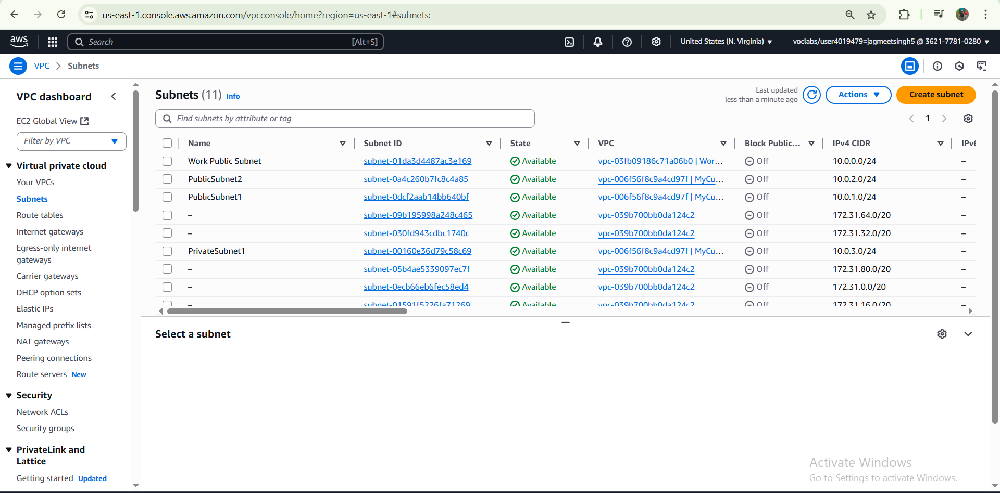
### 🧾 VPCErDiagram

### 🧾 CreatedNewVPC
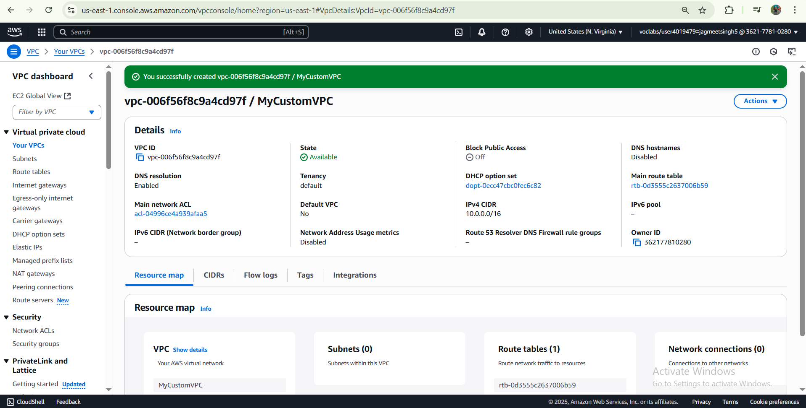
### 🧾 LambdaLogsInsight
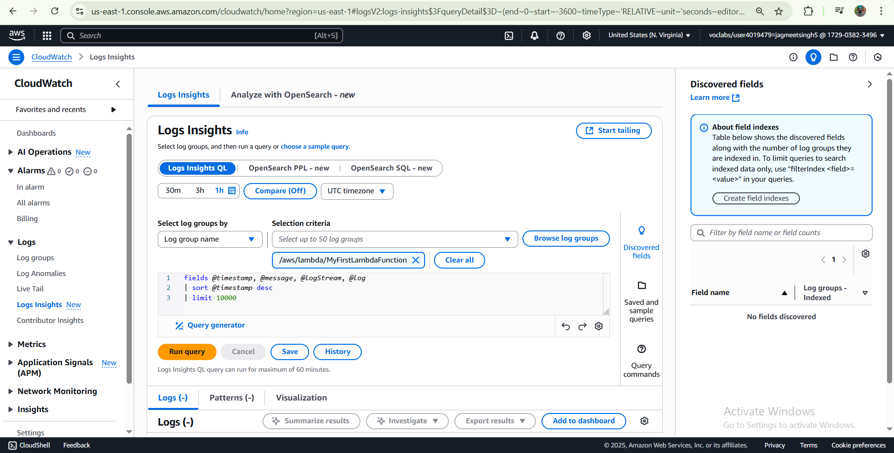
### 🧾 RoutetableLinkedtoInternet
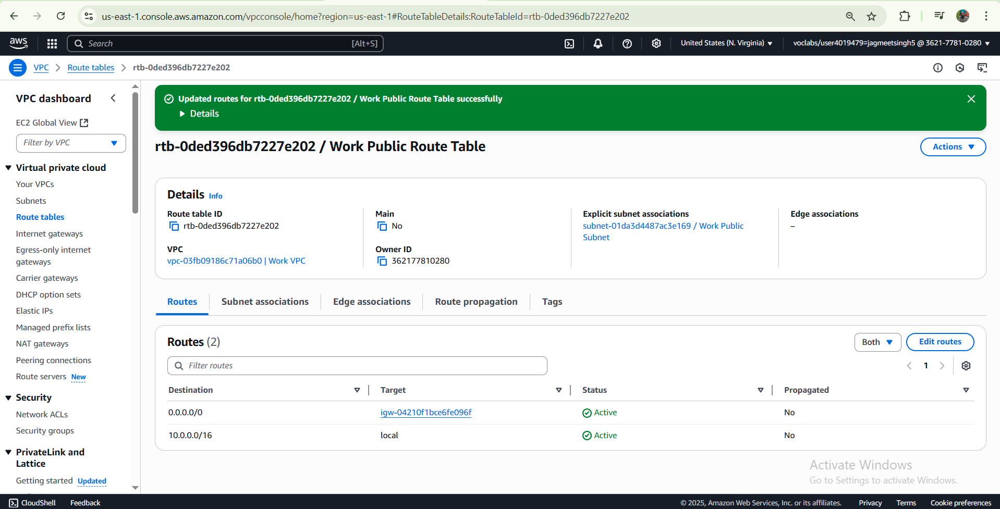
### 🧾 LambdaFunctionExecution
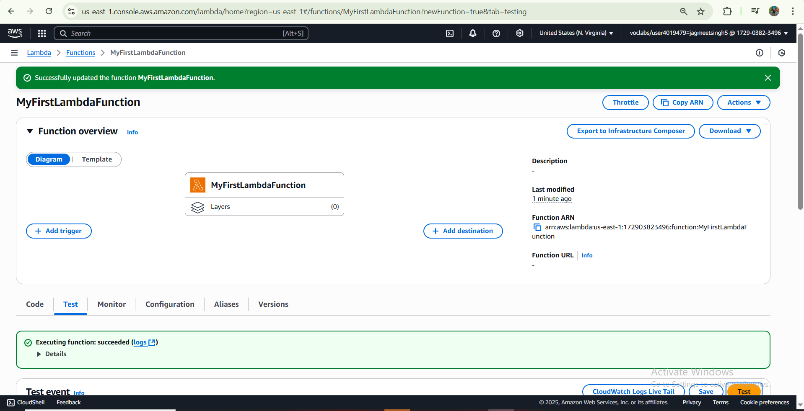
### 🧾 LambdaCLoudwatchMetrics
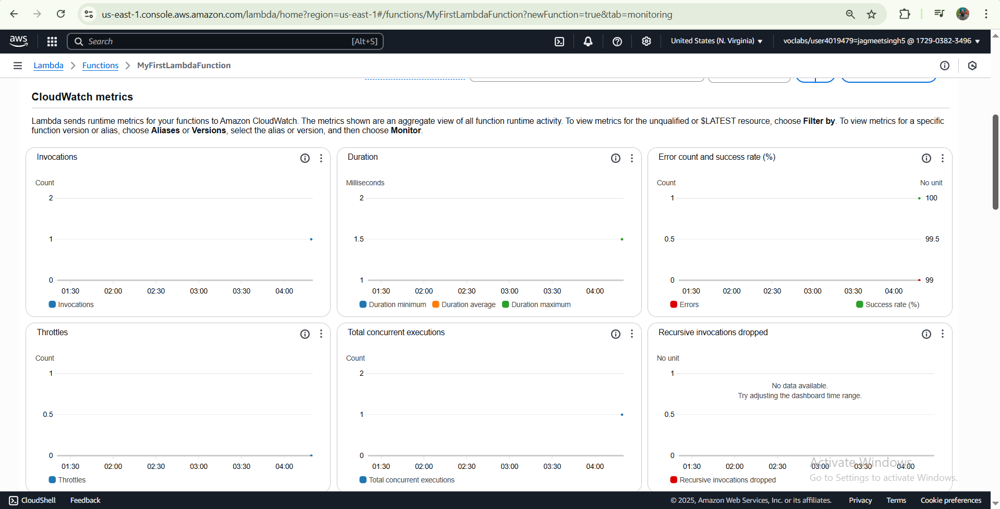
### 🧾 EBS
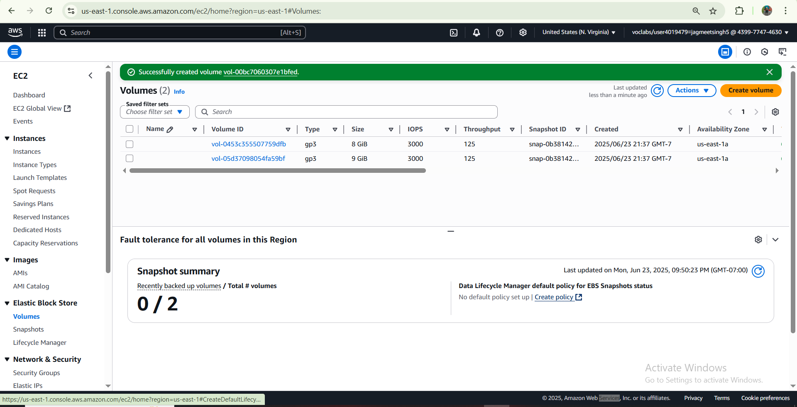
### 🧾 EC2LaunchInstances got permissionError
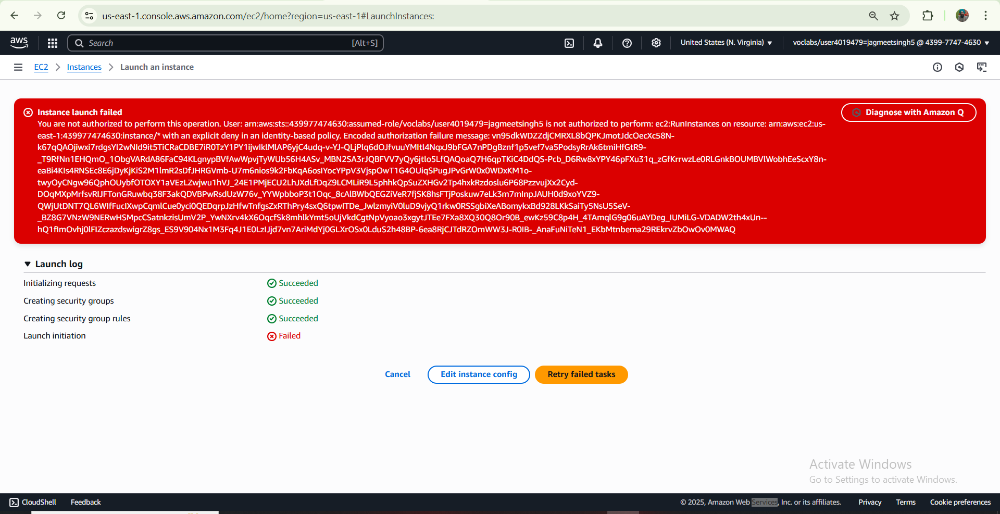
### 🧾 EC2Instancelabshoterror
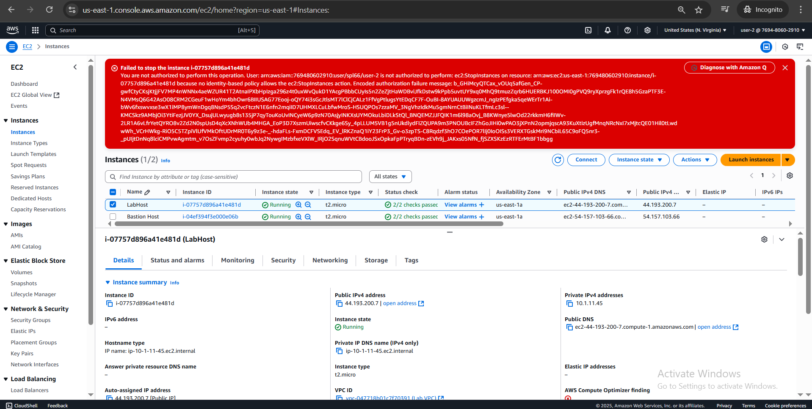
Due to IAM policy restrictions in the lab environment, I was unable to launch an EC2 instance using EC2: RunInstances.

**Error Message: **
“You are not authorized to perform: ec2: RunInstances on resource…”

Because of this, I could not attach an EBS volume to an instance. However, I understand the process and have documented the steps as follows:
1. Create an EBS volume in the same availability zone as the instance.
2. Attach the volume via the EC2 console.
3. Format and mount it using SSH if access is granted.

